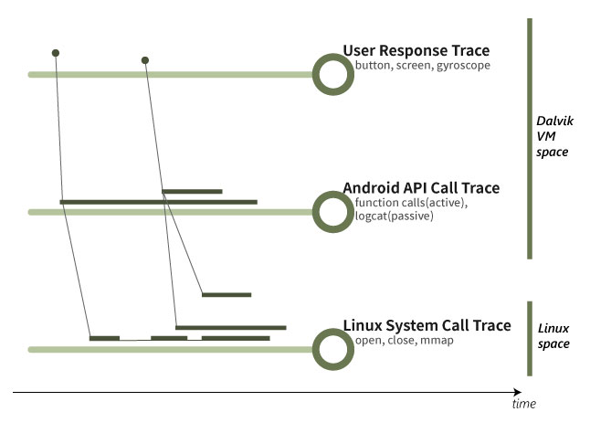
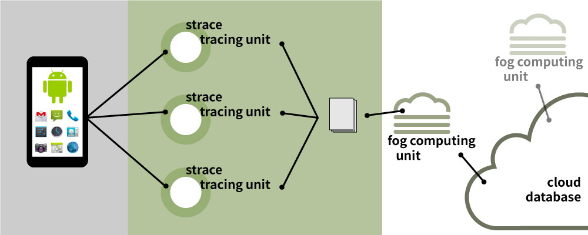

# Title

## 引言
隨著製程的進步與開源軟體的發展，Android不論在手機開發商、手機軟體開發商、與終端使用者眼中都已經是一個漸趨成熟、進步的手機平台。也因此受到了許多駭客(cracker)的注意，想藉由惡意軟體的散佈竊取個人資料，直接或間接的獲取利益。由Sophos的研究[1]中可以看出，Android平台上出現的惡意軟體(malware)在2013~2015年成長了數十倍。能夠有效的分析Android軟體的行為，並區分出其中的惡意軟體變得十分重要。由於惡意軟體所運行的平台是運算能力與電源受到限制的手持裝置，能夠盡可能的降低客戶端的運算也是研究必須考慮的目標。

本研究有三個主要的目標。其一，找出能夠有效代表Android軟體運行行為的序列，因此我們能用這個序列進行分析，藉以區分出惡意軟體。其二，為了降低客戶端的運算，規劃一個雲端服務來分析蒐集到的序列進行分析，並能將結果回傳。其三，建立模型來判斷接收到的序列是否有高機率為惡意軟體。

## 背景與方法探討
本節將本研究依據上述三個目標分述相關的研究背景。

### Android應用程式分析
有很多種方式可以記錄一個Android應用程式在執行過程中的行為。傳統上我們可以將分析方式歸類為靜態分析與動態分析。在靜態分析中，分析程式藉由對Android應用程式檔(*.dex)內的Java bytecode藉以了解一個應用程式可能包含的所有行為，分析程式碼執行流程。儘管此類分析在某些情況下能有效找出可疑的惡意軟體，但透過程式碼混淆的手法，能將惡意軟體「變種」成新的惡意程式，因此分析程式必須時常更新病毒定義檔來加入對此新病毒的描述。另外，靜態分析的時間正相關於應用程式大小，也因此在移動裝置中，裝置分析一隨機指定應用程式的效率是未知的。若想避免將所有二進位檔傳送到伺服器端分析，客戶端需要藉由更多運算才能獲得對程式碼更精確的分析。另一方面，動態分析則是在應用程式執行時期記錄其表現的行為、使用者的反應、與作業系統的互動等。由於現在虛擬機器的進步，對應用程式的動態分析能夠平行化，增加執行流程中程式碼覆蓋的比率。當然，其限制在於應用程式未執行前，對應用程式是幾乎未知的。換言之，由於將一個應用程式歸類為可疑的惡意軟體，必須透過對應用程式行為的分析得到，若一惡意軟體在尚未執行到其惡意程序部分前，是無法被偵測到的。

在動態分析中，應用程式執行過程中的行為紀錄又可被大致分成三類。

1. 使用者對應用程式的回饋。其中包含對螢幕位置的點擊、長按、拖放、滑動(swipe)、縮放(pinch)等，對實體按鈕的按壓與手機硬體包含的GPS、三軸重力儀等感測器。
2. 對Android 底層系統的回饋，可分為主動式與被動式的紀錄。主動式紀錄主要藉由紀錄呼叫Android底層的API序列，主要可得到各個Activity的生命週期與對感測器與螢幕繪圖的程序呼叫；被動式紀錄藉由logcat了解程序執行過程的輸出，其限制在於其內容是由程式開發者所提供，因此能夠獲得的內容無法全部掌握。此方式能夠明確獲得Dalvik VM接受的應用程式請求，但若使用Java Native Interface(JNI)介面則某些由C/C++撰寫的程序將無法獲知其行為。
3. 透過應用程序對Linux的系統呼叫（system call）。由於一個Android API call可以對應到有限的Linux呼叫集合，此一方法有可能會增加分析過程的複雜度。然而此方式可以最精確的得到應用程式執行時期的行為描述。

此三種方法的概略關係可由圖一描述。由圖中可看出，對於使用者的單一反應，可能觸發應用程式對Android系統API的多個呼叫，其呼叫又會呼叫多個Linux系統呼叫。

我們可以把系統呼叫序列認為是應用程式在某段時間內一連串動作的結果。惡意軟體並不是任何時候都在進行惡意行為，但這些惡意行為產生的system call序列應該與正常程式的有所差異。在2011的一篇研究中[4]已經能由自行建立的正規運算式辨識出惡意軟體的系統呼叫特徵序列。若能透過正常程式的行為自動辨識惡意軟體的系統呼叫序列，必然能簡化惡意軟體偵測的流程。

### MUM和序列分析
若將系統呼叫序列作為應用程式行為的描述，則對序列的分析即是建立模型以區分正常的應用程式與惡意軟體。許多研究[2]\[3]利用Profile Hidden Markov Models (PHMM)來分析得到的序列。

生物資訊工程也是個同樣用於序列分析的領域。由於基因工程與電腦計算能力的進步，研究人員可以使用序列比對來辨識基因序列中功能相似的區段，或由比對結果了解物種間的遺傳關係。PHMM也因此早已廣泛的套用在此類型物種比對上。相較於PHMM透過分析將資料庫中的序列轉換為馬克夫鏈矩陣的機率模型，Maximal Unique Match decomposition (MUM)是另一種透過樹狀資料結構建立精確比對的演算法[5]。透過MUM得到的結果是完全一致的序列片段，而非機率模型產生的結果。

由圖二可看出，雙序列比對（pairwise alignment）可用來找出兩短序列中全域或局部的相似片段。當我們將其應用在系統呼叫序列時，基因序列比對軟體能快速找出兩系統呼叫序列中同樣出現的區段。

### 霧運算（Fog Computing）
##實作
MalwareAnalyst是本研究根據上文所述的三個目標的研究成果所實現的系統。它被設計為非常精簡，消耗少量CPU時間，並可隨時針對某一現存於本地端的應用程式做行為記錄，將紀錄檔傳送到雲端上分析，因此運算量並不會對正常手機使用造成負面影響。雲端系統又可分為資料庫端與運算端，在分析請求的序列時動態更新模型以提高辨識率。其中概略的資料流向可由圖三表示。

藉由MalwareAnalyst，使用者與研究人員可以快速偵測可疑的應用程式，而不用將上傳應用程式給擁有龐大資料庫的病毒分析程式。以下詳細說明MalwareAnalyst在三個研究目標的實作，根據資料流向將分析過程分為行為記錄、序列分析與雲端架構三個部分。

### 行為記錄
為了減少本機端的CPU運算量，MalwareAnalyst採用動態的、行為描述的分析方式來辨識惡意軟體。應用程式的行為在本研究中被定義為Linux系統呼叫序列，並透過查詢Linux原始碼的標頭檔將read(), open()等系統呼叫程序名稱轉換成可共同比較的編號。一筆行為紀錄的長度取決於被記錄應用程式的狀態，其可能的內容如下：

`1, 132,166, 155, 4, 4, 4, 56, 24, ...`

主要的記錄程式改寫自普遍應用在Linux上的strace。對於所有被選中的應用程式，系統採取Round robin的監測模式，依序對其做一固定時間的記錄，因此，減少監測的應用程式數量可以讓監測頻率上升，而能更完整記錄應用程式行為。增加同時分析的個體數量也能同時達到其效果。值得注意的是，對於某一特定被記錄的應用程式，MalwareAnalyst並沒有無時無刻記錄其應用程式行為；其被記錄的時間反比於所有被記錄應用程式的數量。然而由於惡意軟體進行惡意行為的時間是未知（或隨機的），在足夠時間內，我們依然能夠記錄到其惡意行為產生的系統呼叫。

將監測得到的資料會暫存在本地端後，MalwareAnalyst在適當時間將資料經由網路傳送至伺服器分析。

### 序列分析
本研究提出的序列比對可以分為兩個步驟

#### 比對（Align)
透過建立正常程式的系統呼叫序列資料庫，相當於記錄正常程式的動作集合。計算未知程式的系統呼叫序列與資料庫出現相同片段的次數，可以了解
未知程式的動作是否在正常程式中頻繁出現。若是未頻繁出現，即有較高機率是惡意軟體。值得一提的是，儘管此系統是建立一normal model，並將不屬於此normal model的程式判定為可能的惡意軟體，即此系統並不一定要將行為已確定非惡意軟體的程式加入模型中。

令某長度為$$$L$$$的序列$$$S_{target}$$$ 與 資料庫中的序列集合 $$$S_1, S_2, S_3...$$$分別進行雙序列比對後得到$$$N$$$筆資料，其中每筆資料可以用數對$$$(m,n)$$$表示，代表目標序列$$$S_{target}$$$中的$$$[m, m+n)$$$能夠在資料庫中找到。

對此我們建立一長度為$$$L$$$的陣列記錄能在資料庫中搜尋到的數量。下圖為測試資料中數筆序列經過分析後得到的結果。

[\\]: 圖四

最後，設立一些過濾原則用以判讀惡意軟體

1. 指定一系統參數$$$ \rho $$$，當數量小於$$$\rho$$$時即判定為未頻繁出現的片段
2. 未頻繁出現的片段的數量必須大於2(其數字來由是最小比對長度--4--的二分之一)才會被判定為高機率惡意軟體

由於$$$\rho$$$的大小與資料庫中的序列高度相關，因此應由動態調整的方式以獲得最高的辨識率。其機制在下節討論。

#### 訓練（Train)
為了讓資料庫可以能包含更廣泛的動作行為，應有一機制可以更新資料庫中的序列集合。然而，若不論如何都將所有已知正常的序列加入資料庫，可能影響比對時未知序列片段出現次數的統計。為此，此系統使用一驗證機制更新資料庫，並能防止資料庫對於內部的測試資料過適（overfitting）。

首先，系統內含有一驗證集合（validation set）。系統使用此驗證集合來評估目前資料庫對於外來序列的分析正確率。在每次資料庫更新請求時，資料庫比對加入資料庫前後對於驗證集合的正確性。因此我們能夠透過選擇性的更新資料庫，讓整體的正確率提昇。

再者，為了避免使系統達到局部極大值（local maximum）使得任何資料庫更新請求都拒絕，每次的資料庫增加請求的處理都會有四種可能性

1. 增加請求的序列到資料庫中
2. 增加請求的序列到資料庫中，並隨機移除同樣數量的序列
3. 拒絕資料庫新增請求，並維持原本的資料庫
4. 拒絕資料庫新增請求，並隨機移除同樣數量的序列

透過驗證集合的機制，系統會選擇四種可能性中使正確率最高的選項。在此過程中，系統也會調整出最佳的$$$\rho$$$值。

### 雲端架構
<!--伺服器又可分為計算功能導向的霧運算單元與資料儲存導向的cloud database。霧運算單元接受使用者的資料作分析，另一方面接受由雲端資料庫所發出的資料庫更新要求。唯有當雲端判斷更新資料庫可以提高判斷正確率時，霧運算單元才會收到由雲端發出的資料庫更新要求。-->

##結果與結論
在測試實驗中，資料庫中有$$$D = 1000$$$筆正常程式的序列，每筆序列的長度皆大於$$$20$$$，$$$5$$$個資料庫請求，每個請求包含$$$20$$$筆序列。另外還有資料庫內部驗證集合$$$V = 100$$$筆資料，其中包含$$$30$$$筆惡意軟體產生的資料。最後，有$$$R = 20$$$筆代表使用者產生的分析請求。

##引用
[1] Sophos detects 100% of Android malware in independent test – for the sixth time in a row
https://blogs.sophos.com/2015/08/14/sophos-detects-100-of-android-malware-in-independent-test-for-the-sixth-time-in-a-row/

[2] Ravi S., Balakrishnan N. and Venkatesh B. (2013), "Behavior-based Malware Analysis using Profile Hidden Markov Models," Proceedings of the 10th International Conference on Security and Cryptography, pages 195-206. DOI: 10.5220/0004528201950206

[3] Saradha R., Nikhil K., Balakrishnan N. (2011) "Behavior-based malware classification using Profile Hidden Markov Models". Poster accepted at the Women in Machine Learning Workshop (NIPS 2011), Granada, Spain.

[4] T. Isohara, K. Takemori and A. Kubota, "Kernel-based Behavior Analysis for Android Malware Detection," Computational Intelligence and Security (CIS), 2011 Seventh International Conference on, Hainan, 2011, pp. 1011-1015.

[5] Stefan Kurtz, Adam Phillippy, Arthur L Delcher, Michael Smoot, Martin Shumway, Corina Antonescu and Steven L Salzberg, "Versatile and open software for comparing large genomes".
http://genomebiology.biomedcentral.com/articles/10.1186/gb-2004-5-2-r12